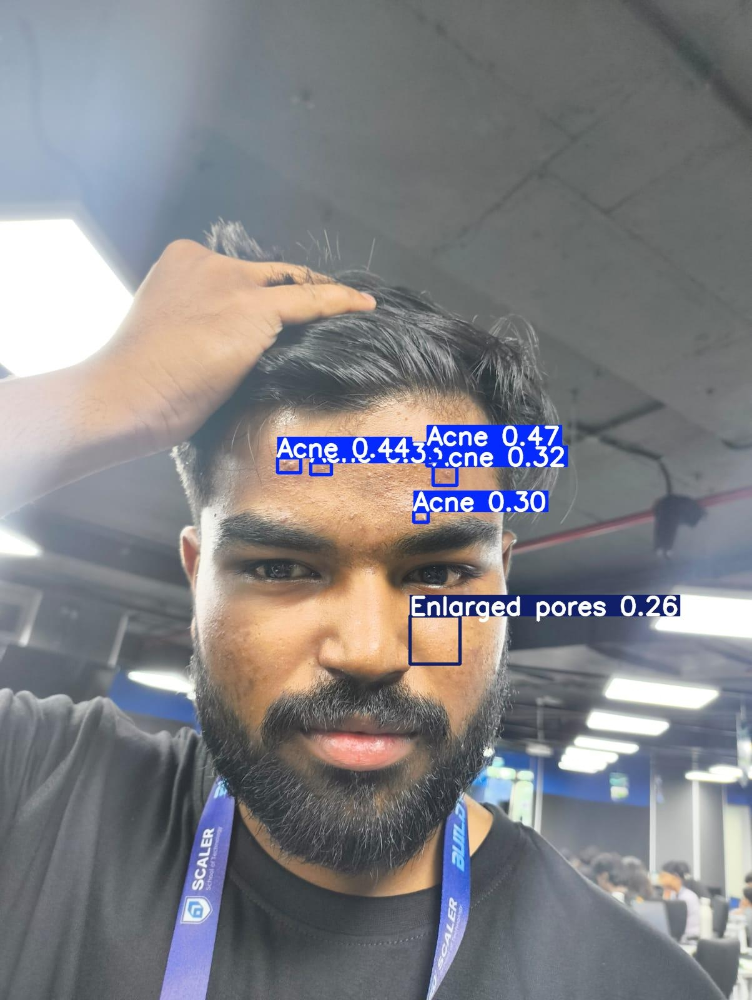

# Care Canvas  
*Your Personalized Skincare Companion*

CareCanvas is a smart skincare assistant that simplifies personalized skin care to your daily routine. With powerful AI-driven analysis and thoughtful tracking, CareCanvas helps you take control of your skincare journey—no guesswork, just results.

---

## ✨ Features

### 🧴 Skin Care Routine  
Get a customized daily routine based on your skin type, concerns, and goals. Whether it's hydration, acne control, or anti-aging, CareCanvas builds a regimen that adapts to your progress.

### 📷 Facial Image Analyzer  
Upload your facial images and let our custom-trained AI analyze them for skin concerns like acne, dryness, dark spots, wrinkles, and more. See exactly where problem areas are with visual feedback.  

### 📈 Progress Tracker  
Track improvements in your skin over time with regular photo comparisons and detailed skin health metrics. See your journey from start to glow.

### 🧪 Ingredient Checker  
Scan product ingredients to check for harmful or incompatible compounds based on your skin profile. Get real-time feedback before you apply.

---

## 🚀 Getting Started
Access our product hosted at:  
https://buildverse-build-ofqgnfbxjukvtcyd35ce2h.streamlit.app/